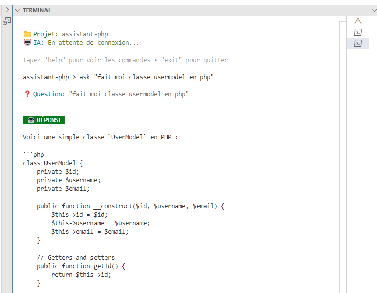

# UN ASSISTANT DE CODE PHP 100% INDEPENDANT AVEC QWEN2.5-CODER SUR VPS DISTANT

## 'model' => 'qwen2.5-coder:1.5b',

Idée de base: "Assistant de coding PHP"
    ↓
CLI avec CLImate + Guzzle
    ↓  
Connexion VPS Ollama distant
    ↓
qwen2.5-coder:1.5b (1GB, ultra rapide)
    ↓
Prompt engineering pour dev expert
    ↓
RÉSULTAT = Mentor IA qui code comme un senior ! 🤖💪

Truc de pro
Vous pouvez aussi faire une commande ask-long pour les questions qui nécessitent des réponses détaillées :
ash> ask "question courte"      # max_tokens: 1500
> ask-long "question détaillée"  # max_tokens: 4000b